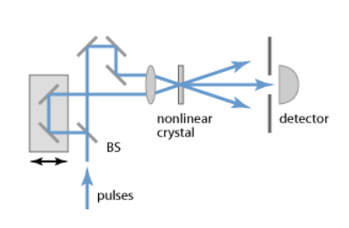

***********
Calibration
***********

To overcome the difficulty in measuring the incident angle :math:`\phi`
of the primary beams, the following methode is applied.

By shifting the mirror stage in the optical delay line,
:numref:`Fig. %s <fig-delay_line>`, a delay :math:`\Delta t` is added
between the two input pulses, resulting in a shift :math:`\Delta Z_0`
of the center of SH transverse distribution

.. math::
      \Delta Z_0 = \frac{\Delta t \cdot u}{2 \cdot sin(\phi/2)}  
	
.. _fig-delay_line:

   Setup of an intensity autocorrelator. BS refers to the beam splitter.

				     
Combining equations on transverse profile :math:`D_z` with shift
:math:`\Delta Z_0` the dependence on the intersection
angle :math:`\phi` is removed, and the pulse duration can be obtained as

.. math::
   \tau_p = D_z \cdot \frac{1}{2} \cdot \frac{\Delta t}{\Delta Z_0}

The ratio :math:`K = \frac{\Delta t}{\Delta Z}` is a calibration factor
which allows the convertion of the SH transverse profile (measured in
pixel unit) in the pulse time profile (measured in femtosecond unit).

Its determination with sufficient accuracy is challenging.
To overcome this difficulty the following procedure is applied. One of the two
optical paths can be varied by pulling or pushing one mirror in the line in a
controllable way using a micrometer. A change :math:`\Delta l` of the
micrometer head position results in a pulse delay of
:math:`\Delta t = 2\Delta l / c` and in the shift
:math:`\Delta Z_0`.
Thus, shifting the SH distribution, as measured in the CCD camera, in
two extreme opposite positions (1 & 2) of the sensitive area allows
the measurements
of calibration factor with a lower relative uncertainty as shown in the steps
here below:

.. math::
   \Delta t = 2\Delta l / c

.. math::
   \Delta t_1 - \Delta t_2 = 2(\Delta l_1 - \Delta l_2) / c

Considering the above espression of :math:`\tau_p`,

.. math::
   \Delta t_1 - \Delta t_2 = 2\cdot \tau_p/D_z (\Delta Z_1 - \Delta Z_2)

.. math::
   (\Delta l_1 - \Delta l_2)/c = \tau_p/D_z (\Delta Z_1 - \Delta Z_2)

resulting in 

.. math::
   \tau_p = D_z \cdot \frac{1}{2} \cdot (\frac{2}{c} \cdot \frac{\Delta l_1 -
   \Delta l_2}{\Delta Z_1 - \Delta Z_2})

This way, the calibration factor
:math:`K = (\frac{2}{c} \cdot \frac{\Delta l_1 - \Delta l_2}{\Delta Z_1 - \Delta
Z_2}) [\frac{fs}{pxl}]` can be calculated with a larger relative precision
from a reproducible and controllable procedure.

It should be noted that the multiplying factor 1/2 in the above equation
results from the initial and not-realistic assumption of a rectangular time
profile and uniform transverse intensity profile for the incoming beams.
More realistic models for the unknown time shape of initial pulses should
be considered. Assuming the Gaussian and hyperbolic secant shapes for
the pulse time-profile results in the factors 1/2 and 1/1.54, respectively.

The oscillator pulse duration is then calculated as the mean value of these
extracted values, and the contribution from model uncertainty to the
global systematical uncertainty can be estimated as half of the maximum
deviation between the two calculated values.

The above mentioned calibration steps are handled by the device
configuration editor. The user should take care to properly
select the fitting region reducing the contribution from the fundamental beams.
The fitting window can be optimized configuring the keys **Fit Lower Limit**
and **Fit Upper Limit**.
Also, attention should be taken in order not to cut the profile tail
of the SH beam thus affecting the measurement of the FWHM.

After moving the generated SH beam to one side of the sensitive area of the
CCD camera (by properly shifting the optical delay line with the micrometer),
by clicking on **Current Image as 1st Calibration** the current values of
peak position and FWHM will be set as **Image1 Peak (x)** and
**Image1 FWHM (x)**, respectively. Similarely, the second set of calibration
parameters are obtained steering the SH profile in the other side of the
camera and clicking on **Current Image as 2nd Calibration**

Once the two calibration images are acquired, the calibration constant
:math:`K` can be calculated by

* setting the **Delay Unit** to :math:`\mu m`

* pi
