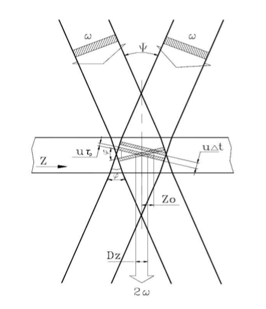
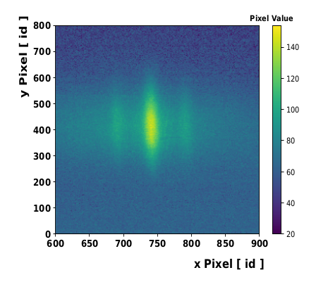
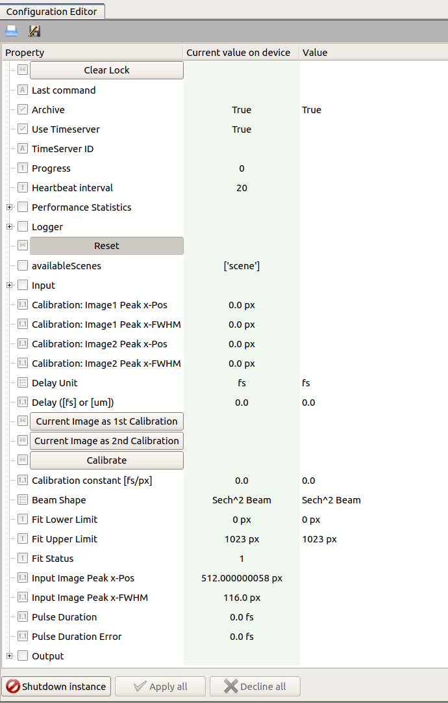

************
Introduction
************

The AutoCorrelator device is designed to provide an online
determination of the pulse duration using a single-shot auto
correlator [1]_.

The measurement of the time profile of pulses is based on the following
principle, graphically displayed in :numref:`Fig. %s <fig-principle>`.
The input beam is sent to a beam-splitter; the two identical
beams propagate along two distinct optical paths until they intersect
in a non-linear crystal. Here, due to the high-intensity of the beams,
a second harmonic beam (SH) is created and its integrated energy is
measured by a CCD camera located after the crystal.

.. _fig-principle:

   The diagram describes geometrically the
   intersection of two identical beams in a
   crystal and the generation of the second
   harmonic beam.

The pulse duration of laser pulses can be determined upon measuring
the transverse distribution of the energy deposited in the CCD camera.
From geometrical considerations in :numref:`Fig. %s <fig-principle>`,
assuming for the incoming beams a rectangular time profile
:math:`\tau_p` and uniform transverse intensity profile, it is
found that the transverse profile :math:`D_z` of the second harmonic
depends on the pulse duration :math:`\tau_p` of the fundamental beams,

.. math::
   D_z = \frac{\tau_p \cdot u}{sin(\phi/2)}
	   
.. math::
   \tau_p = D_z \cdot \frac{1}{2} \cdot \frac{\Delta t}{\Delta Z_0}
   
where :math:`u = c/n` and :math:`\phi` are the speed of light and the
intersection angle of input beams, respectively, in the crystal with
refractive index :math:`n`.
The transverse profile :math:`D_z` is determined from the data accumulated
with the CCD camera available in the system.
An example of camera image is presented in :numref:`Fig. %s <fig-SH_profile>`:

.. _fig-SH_profile:

   The fundamental beams and the second harmonic beam
   are detected in the CCD camera located after the non-linear crystal.

The figure shows clearly the deposited energy from the signal of the generated
second harmonic beam (central and more intense peak) and of the two
fundamental beams (low intensity side signals). The transverse profile
:math:`D_z` is determined as FWHM from the fit to the SH peak.

The angle :math:`\phi` cannot
be measured with sufficient precision for a reliable extraction of pulse
duration :math:`\tau_p`. The way used in the device to determine the pulse
duration from the measured transverse profile is presented the calibration
section.

The device configuration editor is presented
in :numref:`Fig. %s <fig-editor>`,

.. _fig-editor:

	   
   Configuration Editor of the autocorrelator device.

The camera device providing the image of the beam profile should be
set in the key **input.connectedOutputChannels** of the autocorrelator
device.
For each camera image the projection along the x-axis is calculated,
a fit is performed according to a selectable model (**Beam Shape**)
for the time-profile of the pulse, and the peak position and FWHM are
determined from the fitting function (**Input Image Peak x-Pos** and
**Input Image Peak x-Pos**). The **Fit Error** parameter is an
integer flag describing the fit status. If it is equal to 1, 2, 3 or 4,
the solution was found, otherwise the solution was not found [2]_.
The possible fit status values are:

* 0: Improper input parameters were entered,

* 1: The solution converged,

* 2: The number of calls to function has reached default max number,

* 3: Max for relative error is too small, no further improvement in the approximate solution is possible,

* 4: The iteration is not making good progress, as measured by the improvement from the last five Jacobian evaluations,

* 5: The iteration is not making good progress, as measured by the improvement from the last ten iterations,

* 'unknown': "An error occurred.

The result of pulse duration is presented only in case of a solution is found,
and the fit status value is lower than four.

.. [1] RP Photonics Encyclopedia, https://www.rp-photonics.com/autocorrelators.html
.. [2] Scipy.org, https://github.com/scipy/scipy/blob/master/scipy/optimize/minpack.py
