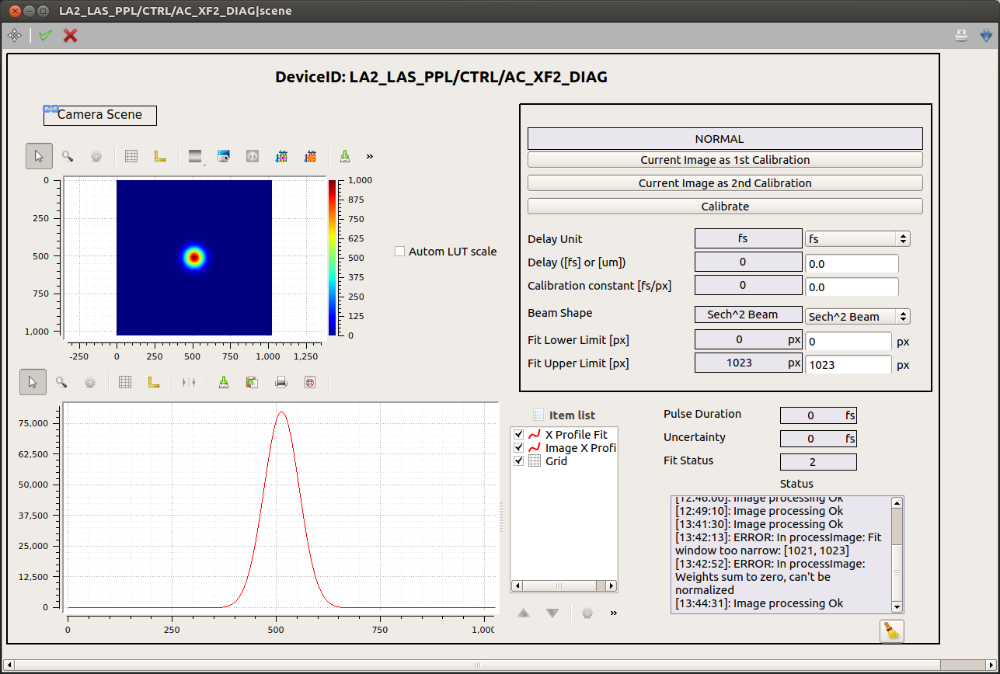

*************
Device Scenes
*************
At the moment, one scene is auto-generated by the device.

It can be opened either by right-clicking on the device name, and selecting
from the drop up menu the item *Open device scene*, or double-clicking
on the device name.

An example of scene is presented in :numref:`Fig. %s <fig-scene>`:

.. _fig-scene:

   The scene for auto-correlator device.

All calibration parameters are available in the upper-right sub-panel.
The image x-profile is shown superimposed to the fitting function.
To deselect one of the graphs use the item list widget. If not yet
visible, this widget can be activated from the drop up menu showing up
by right-clicking on the graph.

A log of the device **status** is also provided.
Note that only messages appeared after the opening of the scene will
be displayed.
 
A link to its
auto-generated scene is provided, allowing the user to configure the
camera without having to navigate in the project.
