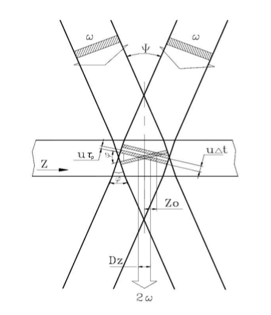
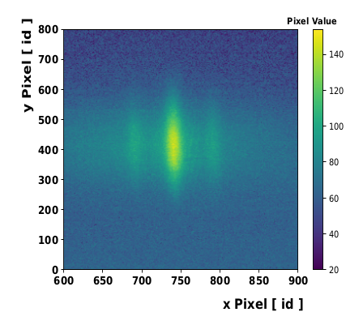
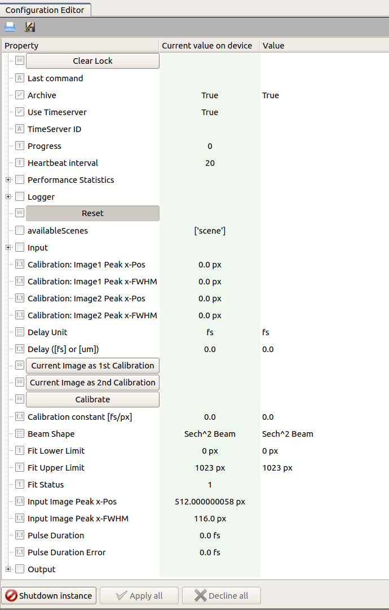
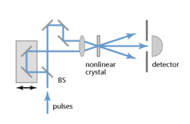
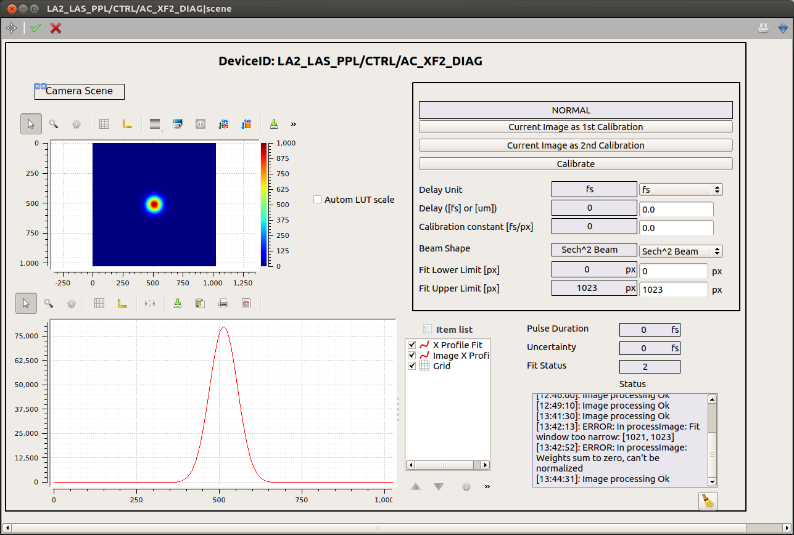

***************
Auto Correlator
***************

The AutoCorrelator device is designed to provide an online
determination of the pulse duration using a single-shot auto
correlator [1]_.

The measurement of the time profile of pulses is based on the following
principle, graphically displayed in :numref:`Fig. %s <fig-principle>`.
The input beam is sent to a beam-splitter; the two identical
beams propagate along two distinct optical paths until they intersect
in a non-linear crystal. Here, due to the high-intensity of the beams,
a second harmonic beam (SH) is created and its integrated energy is
measured by a CCD camera located after the crystal.

.. _fig-principle:

   The diagram describes geometrically the
   intersection of two identical beams in a
   crystal and the generation of the second
   harmonic beam.

The pulse duration of laser pulses can be determined upon measuring
the transverse distribution of the energy deposited in the CCD camera.
From geometrical considerations in :numref:`Fig. %s <fig-principle>`,
assuming for the incoming beams a rectangular time profile
:math:`\tau_p` and uniform transverse intensity profile, it is
found that the transverse profile :math:`D_z` of the second harmonic
depends on the pulse duration :math:`\tau_p` of the fundamental beams,

.. math::
   D_z = \frac{\tau_p \cdot u}{sin(\phi/2)}
	   
.. math::
   \tau_p = D_z \cdot \frac{1}{2} \cdot \frac{\Delta t}{\Delta Z_0}
   
where :math:`u = c/n` and :math:`\phi` are the speed of light and the
intersection angle of input beams, respectively, in the crystal with
refractive index :math:`n`.
The transverse profile :math:`D_z` is determined from the data accumulated
with the CCD camera available in the system.
An example of camera image is presented in :numref:`Fig. %s <fig-SH_profile>`:

.. _fig-SH_profile:

   The fundamental beams and the second harmonic beam
   are detected in the CCD camera located after the non-linear crystal.

The figure shows clearly the deposited energy from the signal of the generated
second harmonic beam (central and more intense peak) and of the two
fundamental beams (low intensity side signals). The transverse profile
:math:`D_z` is determined as FWHM from the fit to the SH peak.

The angle :math:`\phi` cannot
be measured with sufficient precision for a reliable extraction of pulse
duration :math:`\tau_p`. The way used in the device to determine the pulse
duration from the measured transverse profile is presented the calibration
section.

The device configuration editor is presented
in :numref:`Fig. %s <fig-editor>`,

.. _fig-editor:

	   
   Configuration Editor of the autocorrelator device.

The camera device providing the image of the beam profile should be
set in the key **input.connectedOutputChannels** of the autocorrelator
device.
For each camera image the projection along the x-axis is calculated,
a fit is performed according to a selectable model (**Beam Shape**)
for the time-profile of the pulse, and the peak position and FWHM are
determined from the fitting function (**Input Image Peak x-Pos** and
**Input Image Peak x-Pos**). The **Fit Error** parameter is an
integer flag describing the fit status. If it is equal to 1, 2, 3 or 4,
the solution was found, otherwise the solution was not found [2]_.
The possible fit status values are:

* 0: Improper input parameters were entered,

* 1: The solution converged,

* 2: The number of calls to function has reached default max number,

* 3: Max for relative error is too small, no further improvement in the approximate solution is possible,

* 4: The iteration is not making good progress, as measured by the improvement from the last five Jacobian evaluations,

* 5: The iteration is not making good progress, as measured by the improvement from the last ten iterations,

* 'unknown': "An error occurred.

The result of pulse duration is presented only in case of a solution is found,
and the fit status value is lower than four.

.. [1] RP Photonics Encyclopedia, https://www.rp-photonics.com/autocorrelators.html
.. [2] Scipy.org, https://github.com/scipy/scipy/blob/master/scipy/optimize/minpack.py

Calibration
===========

To overcome the difficulty in measuring the incident angle :math:`\phi`
of the primary beams, the following method is applied.

By shifting the mirror stage in the optical delay line,
:numref:`Fig. %s <fig-delay_line>`, a delay :math:`\Delta t` is added
between the two input pulses, resulting in a shift :math:`\Delta Z_0`
of the center of SH transverse distribution

.. math::
      \Delta Z_0 = \frac{\Delta t \cdot u}{2 \cdot sin(\phi/2)}  
	
.. _fig-delay_line:

   Setup of an intensity autocorrelator. BS refers to the beam splitter.

				     
Combining equations on transverse profile :math:`D_z` with shift
:math:`\Delta Z_0` the dependence on the intersection
angle :math:`\phi` is removed, and the pulse duration can be obtained as

.. math::
   \tau_p = D_z \cdot \frac{1}{2} \cdot \frac{\Delta t}{\Delta Z_0}

The ratio :math:`K = \frac{\Delta t}{\Delta Z}` is a calibration factor
which allows the conversion of the SH transverse profile (measured in
pixel units) to the pulse time profile (measured in femtosecond units).

Its determination with sufficient accuracy is challenging.
To overcome this difficulty the following procedure is applied. One of the two
optical paths can be varied by pulling or pushing one mirror in the line in a
controllable way using a micrometer. A change :math:`\Delta l` of the
micrometer head position results in a pulse delay of
:math:`\Delta t = 2\Delta l / c` and in the shift
:math:`\Delta Z_0`.
Thus, shifting the SH distribution, as measured in the CCD camera, in
two extreme opposite positions (1 & 2) of the sensitive area allows
the measurements
of calibration factor with a lower relative uncertainty as shown in the steps
below:

.. math::
   \Delta t = 2\Delta l / c

.. math::
   \Delta t_1 - \Delta t_2 = 2(\Delta l_1 - \Delta l_2) / c

Considering the above expression of :math:`\tau_p`,

.. math::
   \Delta t_1 - \Delta t_2 = 2\cdot \tau_p/D_z (\Delta Z_1 - \Delta Z_2)

.. math::
   (\Delta l_1 - \Delta l_2)/c = \tau_p/D_z (\Delta Z_1 - \Delta Z_2)

resulting in 

.. math::
   \tau_p = D_z \cdot \frac{1}{2} \cdot (\frac{2}{c} \cdot \frac{\Delta l_1 -
   \Delta l_2}{\Delta Z_1 - \Delta Z_2})

This way, the calibration factor
:math:`K = (\frac{2}{c} \cdot \frac{\Delta l_1 - \Delta l_2}{\Delta Z_1 - \Delta
Z_2}) [\frac{fs}{pxl}]` can be calculated with a larger relative precision
using a reproducible and controllable procedure.

It should be noted that the multiplying factor 1/2 in the above equation
results from the initial and non-realistic assumption of a rectangular time
profile and uniform transverse intensity profile for the incoming beams.
More realistic models for the unknown time shape of initial pulses should
be considered. Assuming the Gaussian and hyperbolic secant shapes for
the pulse time-profile results in the factors 1/2 and 1/1.54, respectively.

The oscillator pulse duration is then calculated as the mean value of these
extracted values, and the contribution from model uncertainty to the
global systematical uncertainty can be estimated as half of the maximum
deviation between the two calculated values.

The above mentioned calibration steps are handled by the device
configuration editor. The user should take care to properly
select the fitting region reducing the contribution from the fundamental beams.
The fitting window can be optimized configuring the keys **Fit Lower Limit**
and **Fit Upper Limit**.
Also, attention should be taken in order not to cut the profile tail
of the SH beam thus affecting the measurement of the FWHM.

After moving the generated SH beam to one side of the sensitive area of the
CCD camera (by properly translating the mirror stage in the
optical delay line with the micrometer),
by clicking on **Current Image as 1st Calibration** the current values of
peak position and FWHM will be set as **Image1 Peak (x)** and
**Image1 FWHM (x)**, respectively. Similarly, the second set of calibration
parameters are obtained steering the SH profile in the other side of the
camera and clicking on **Current Image as 2nd Calibration**.

Once the two calibration images are acquired, the calibration constant
:math:`K` can be calculated by clicking on **Calibrate** after setting

* **Delay Unit** to :math:`\mu m`;

* **Delay** to the entire translation of the mirror stage, equivalent
  to :math:`(\Delta l_1 - \Delta l_2)`. This measurement
  should be taken by the user;
    
or, in case the optical delay between the two calibration images was
provided already in femtosecond unit, after setting

* **Delay Unit** to :math:`fs`;

* **Delay** to the time delay.

The extracted **Calibration constant** allows to calculate the pulse duration
from the measured FWHM :math:`D_z`,  

.. math::

   \tau_p = D_z \cdot \alpha \cdot K,

:math:`\alpha` being the multiplication factor originating from the
model assumed for the time-profile of the pulse.

The uncertainty of the pulse duration is preliminary estimated via error
propagation by the uncertainty on the fit FWHM, assuming
the uncertainty of the calibration constant is negligible
and that no correlation between the fit parameters exists.

Device Scenes
=============

At the moment, one scene is auto-generated by the device.

It can be opened either by right-clicking on the device name, and selecting
from the drop up menu the item *Open device scene*, or double-clicking
on the device name.

An example of scene is presented in :numref:`Fig. %s <fig-scene>`:

.. _fig-scene:

   The scene of the auto-correlator device.

All calibration parameters are available in the upper-right sub-panel.
The image x-profile is shown superimposed to the fitting function.
To deselect one of the graphs use the item list widget. If not yet
visible, this widget can be activated from the drop up menu showing up
by right-clicking on the graph.

A log of the device **status** is also provided.
Note that only messages appeared after the opening of the scene will
be displayed.
 
A link to the camera auto-generated scene is provided, allowing
the user to configure the
camera without having to navigate in the project.

Troubleshooting
===============

Some typical errors have been identified up to now:

- In case the camera device is not instantiated or it is stopped
  the peak position and FWHM should be null, and no calculation of the
  pulse duration can be performed;

- In case no calibration constant is provided, either inserted by the user (if
  previously known) or by following the calibration procedure described in the
  text, the pulse duration is not calculated;

- In case the calibration constant is inserted by the user, and the results
  appear to be very different from what expected, the value used might describe
  no more the current optical setup of the autocorrelator device.
  A new calibration measurement could be performed;

- In case the uncertainty arising from the fit procedure is relative large,
  likely the model used in the fit is not appropriate:

  -- try to use a different available model;

  -- try to optimize the fitting region;

  -- verify that the tails of the second harmonic beam are well within the fitting area;
  
- In case no available model describes correctly the data, 
  an optimization of the optical line setup could be attempted.
