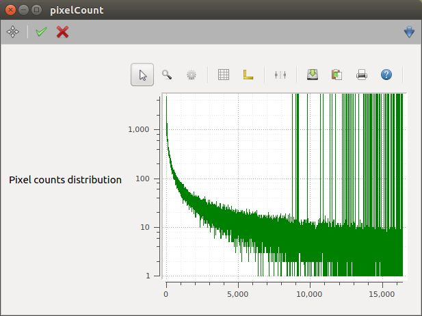

.. _image-processor-user:

***************
Image Processor
***************

The Image Processor device can provide for each incoming image (2D) or spectrum
(1D):

* the minimum, maximum and mean pixel value;
* the frequency distribution of pixel values;
* the image integrals in x and y directions (only for 2D images);
* the centre-of-mass and standard deviation;
* gaussian fit parameters for the x and y integrals (the latter only for 2D
  (images);
* gaussian fit parameters for the 2D image;
* pixel values integral over a region.

Each feature can be enabled or disabled by using the boolean properties
listed in the :ref:`image-processor-general-settings` section.

General settings of the Image Processor are described in the
:ref:`image-processor-enabling-features` section.

Input to the Device
===================

.. _image-processor-general-settings:

General Settings
----------------

The following properties affect all the algorithms ran in the device.

=======================  =====================================================
Property key             Description
=======================  =====================================================
imagePath                | The key where the image will be looked for in the
                         | input data. The default value - ``data.image`` - is
                         | usually appropriate when the input channel is
                         | connected to imagers.
filterImagesByThreshold  | If ``filterImagesByThreshold`` is ``True``, only
                         | images with maximum pixel value exceeding
                         | ``imageThreshold`` will be processed. Others will be
                         | discarded.
imageThreshold           | The threshold for processing an image. See above.
absolutePositions        | If ``True``, the centre-of-mass and fit results will
                         | take into account the current settings for ROI and
                         | binning.
subtractBkgImage         | Subtract the loaded background image.
subtractImagePedestal    | Subtract the image pedestal (i.e. ``image = image -
                           image.min()``).
                         | This is done after background subtraction.
=======================  =====================================================

.. _image-processor-enabling-features:

Enabling Features
-----------------

The different algorithms available can be enabled by setting the following
boolean parameters.

=======================  =======================================================
Property key             Description
=======================  =======================================================
doMinMaxMean             | Get the following information from the pixels: min,
                         | max, mean value.
doBinCount               | Calculate the frequency distribution of pixel values.
                         | The distribution will be available in
                         | ``data.imgBinCount``.
doXYSum                  | Integrate the image along the x- and y-axes.
                         | The distributions will be available in ``data.imgX``
                         | and ``data.imgY``.
doCOfM                   | Calculate centre-of-mass and widths.
do1DFit                  | Perform a 1D gaussian fit of the x- and
                         | y-distributions.
do2DFit                  | Perform a 2D gaussian fits.
                         | Be careful: It can be slow!
doIntegration            | Integrate the pixel values in the specified region.
=======================  =======================================================

Options for Centre-of-Mass
-----------------------------

The user can define a range for the centre-of-mass calculation, and a
pixel threshold to discard background pixels. More details are given
in the table:

=======================  =======================================================
Property key             Description
=======================  =======================================================
comRange                 | The range to be used for the centre-of-mass
                         | calculation. Can be the full range, or a
                         | user-defined one.
userDefinedRange         | The user-defined range for centre-of-mass,
                         | gaussian fit(s) and integrales along the x & y axes.
absThreshold             | Pixels below this threshold will not be used for the
                         | centre-of-mass calculation.
                         | If greater than 0, the relative threshold will not be
                         | used.
threshold                | Pixels below this relative threshold (fraction of the
                         | highest value) will not be used for the
                         | centre-of-mass calculation. It will only be applied
                         | if no absolute threshold is set.
=======================  =======================================================

Options for Gaussian Fit
------------------------

The Gaussian fit is done by using the ``fitGauss`` and ``fitGauss2DRot``
functions available in the :rtd:`image-processing` package.

Initial parameters fit are calculated by the ``peakParametersEval`` function
in the imageProcessing package, when the "raw peak" option is choosen.

The user can define the range used for the Gaussian fit, enable a 1st order
polynomial, define which initial fit parameters shall be used, enable
rotation angle for the 2D Gaussian fit.

More details are given in the table:

=======================  =======================================================
Property key             Description
=======================  =======================================================
pixelSize                | The pixel size. It will be used when evaluating the
                         | beam size.
fitRange                 | The range to be used for fitting. Can be the full
                         | range, an auto-determined, or the user-defined one.
rangeForAuto             | The automatic range for 'auto' mode (in standard
                         | deviations).
userDefinedRange         | The user-defined range.
enablePolynomial         | Add a 1st order polynomial term (ramp) to gaussian
                         | fits.
gauss1dStartValues       | Selects how 1d gaussian fit starting values are
                         | evaluated. The options are: last fit result,
                         | raw peak.
doGaussRotation          | Allow the 2D gaussian to be rotated.
=======================  =======================================================

Options for Integration
-----------------------

The user can define the region to be integrated over.

=======================  =======================================================
Property key             Description
=======================  =======================================================
integrationRegion        | The region to be integrated over.
=======================  =======================================================

Commands
========

The user can select the current image as background image.

=======================  =======================================================
Slot key                 Description
=======================  =======================================================
useAsBackgroundImage     | Use the current image as background image.
=======================  =======================================================

Output of the Device
====================

General properties
------------------

=======================  =======================================================
Property key             Description
=======================  =======================================================
frameRate                | The rate of incoming images. It is refreshed once per
                         | second.
imageWidth               | The width of the incoming image.
imageOffsetX             | If the incoming image has a ROI, this represents the
                         | X position of the top-left corner.
imageBinningX            | The image binning in the X direction.
imageHeight              | The height of the incoming image.
imageOffsetY             | If the incoming image has a ROI, this represents the
                         | Y position of the top-left corner.
imageBinningY            | The image binning in the Y direction.
minPxValue               | The minimum image pixel value.
maxPxValue               | The maximum image pixel value.
meanPxValue              | The mean image pixel value.
=======================  =======================================================

Execution Time
--------------

The time spent in each part of the image processing is calculated and
displayed in the device. The values are refreshed once per second.

=======================  =======================================================
Property key             Description
=======================  =======================================================
minMaxMeanTime           | Time spent for evaluating min, max, mean pixel value.
binCountTime             | Time spent for calculating the frequency distribution
                         | of pixel values.
subtractBkgImageTime     | Time spent in subtracting the background image.
subtractPedestalTime     | Time spent in subtracting the image pedestal.
xYSumTime                | Time spent in integrating the image in X and Y.
cOfMTime                 | Time spent in evaluating the centre-of-mass.
xFitTime                 | Time spent in 1D Gaussian fit of the X distribution.
yFitTime                 | Time spent in 1D Gaussian fit of the Y distribution.
fitTime                  | Time spent in 2D Gaussian fit of the image.
integrationTime          | Time spent in integrating over a region.
=======================  =======================================================

Centre-of-Mass
-----------------

=======================  =======================================================
Property key             Description
=======================  =======================================================
x0                       | X position of the centre-of-mass.
sx                       | Standard deviation in X of the centre-of-mass.
y0                       | Y position of the centre-of-mass.
sy                       | Standard deviation in Y of the centre-of-mass.
=======================  =======================================================

Gaussian Fit
------------

By enabling the 1D fits, the image will be first integrated along Y- and X-
directions, in order to give a 1D distribution. These distributions will be
then fitted with a Gaussian.

=======================  =======================================================
Property key             Description
=======================  =======================================================
xFitSuccess              | 1D Gaussian fit success for the X distribution
                         | (1-4 if fit converged).
ax1d                     | Amplitude ``Ax`` from 1D fit.
x01d                     | ``x0`` peak position from 1D fit.
ex01d                    | Uncertainty on ``x0`` estimation.
sx1d                     | Standard deviation on ``x0`` from 1D fit.
esx1d                    | Uncertainty on standard deviation estimation.
beamWidth1d              | Beam width from 1D Fit. Defined as 4x ``sx1d``.
yFitSuccess              | 1D Gaussian fit success for the Y distribution
                         | (1-4 if fit converged).
ay1d                     | Amplitude ``Ay`` from 1D fit.
y01d                     | ``y0`` peak position from 1D fit.
ey01d                    | Uncertainty on ``y0`` estimation.
sy1d                     | Standard deviation on ``y0`` from 1D fit.
esy1d                    | Uncertainty on standard deviation estimation.
beamHeight1d             | Beam height from 1D Fit. Defined as 4x ``sy1d``.
=======================  =======================================================

By enabling the 2D fit, the 2D pixel distribution will be fitted. Be careful,
for large images it could be quite slow, in particular if you enable rotation
angle!

=======================  =======================================================
Property key             Description
=======================  =======================================================
fitSuccess               | 2D Gaussian fit success (1-4 if fit converged).
a2d                      | Amplitude from 2D fit.
x02d                     | ``x0`` peak position from 2D fit.
ex02d                    | Uncertainty on ``x0`` estimation.
sx2d                     | Standard deviation on ``x0`` from 2D fit.
esx2d                    | Uncertainty on standard deviation estimation.
beamWidth2d              | Beam width from 2D Fit. Defined as 4x ``sx2d``.
y02d                     | ``y0`` peak position from 2D fit.
ey02d                    | Uncertainty on ``y0`` estimation.
sy2d                     | Standard deviation on ``y0`` from 2D fit.
esy2d                    | Uncertainty on standard deviation estimation.
beamHeight2d             | Beam height from 2D Fit. Defined as 4x ``sy2d``.
theta2d                  | Rotation angle from 2D fit.
etheta2d                 | Uncertainty on rotation angle estimation.
=======================  =======================================================

Integration
-----------

=======================  =======================================================
Property key             Description
=======================  =======================================================
regionIntegral           | Integral of pixel value over the specified region.
regionMean               | Mean pixel value over the specified region.
=======================  =======================================================

Other Outputs
-------------

The following vector properties are available in the output channel
named `output`.

=======================  =======================================================
Property key             Description
=======================  =======================================================
data.imgBinCount         | Distribution of the image pixel counts.
data.imgX                | Image integral along the Y-axis.
data.imgY                | Image integral along the X-axis.
=======================  =======================================================

   An example of pixel count distribution.
